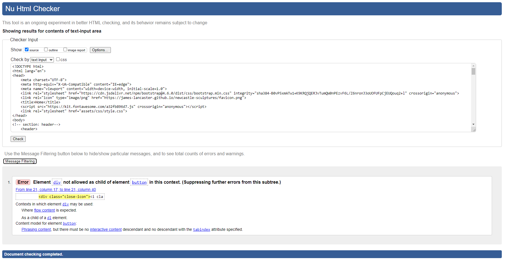
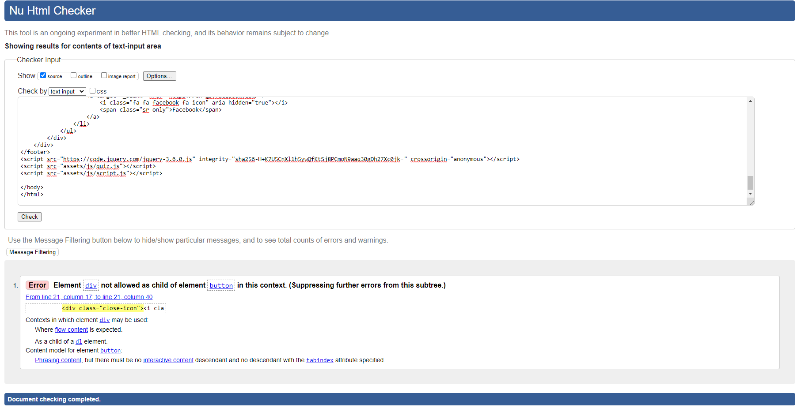
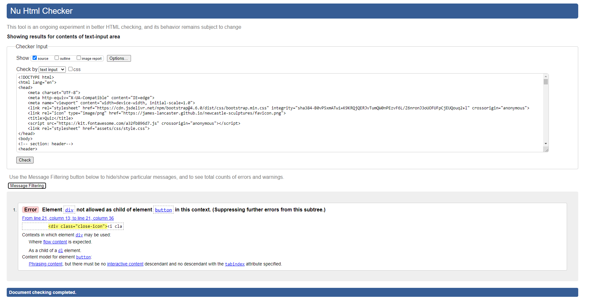
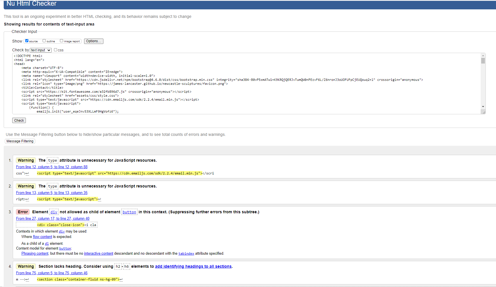
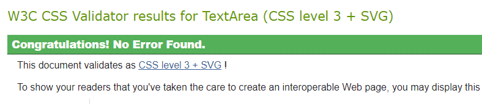
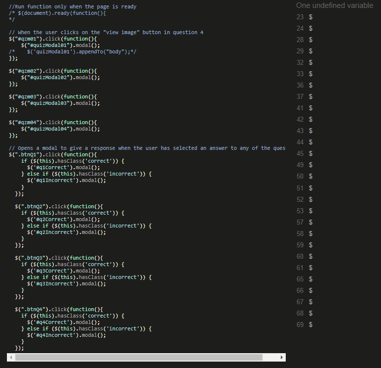
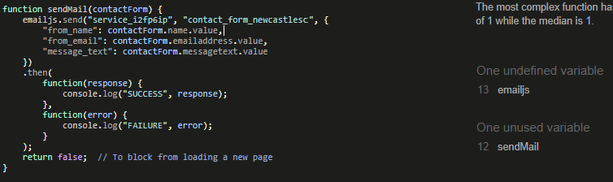

# Newcastle sculpture

Cities and towns the world over are adorned with public sculpture. Much of the time it gets sadly little attention from passers-by. It’s worth stopping to take a look, though, because not only are there some wonderful artistic gems to enjoy, there’s lots to be learned about local history, and about an area’s people and communities. 

As far as I can tell, there are few websites devoted to an individual city or town’s sculpture (Lichfield’s The city of sculpture, (http://www.thecityofsculpture.co.uk/) is a rare example), but I’ve often thought I’d like to be able quickly to find out about an individual city’s public art, and I think there’s enough in Newcastle-upon-Tyne for it to be worthwhile providing a guide for others. In the fullness of time such a guide could provide guided walks and could expand to Northumbria and other cities in the North East. For now, a Newcastle guide might be of interest to visitors and tourists, locals, culture vultures and local history geeks, and those looking for a walk on a Sunday afternoon.

NOTE: This project has not gone as planned. Apart from where identified in the text, I have left both the UX section below and the Figma wireframes unchanged from before I created a Gitpod workspace (apart from URL updates etc) as it may help explain why this was. I  will draw attention to the problems where necessary.
In an attempt to correct errors, I made a fresh repository, 210518_quiz-test. I copied files from this to newcastle-sculpture on 24 May. Unfortunately, this means that there is no record of commits and pushes, although that is part of my normal everyday working.

# UX

## User stories
1. As a first time visitor, I would like to
* easily understand the main purpose of the site and be reassured that I have found a site which may have what I am looking for
* be able to easily navigate throughout the site to find content
* find meaningful content, for instance, relevant information about Newcastle-upon-Tyne and its public art, with images, locations, and background information 
* to find information that would enable me to physically visit the sculptures
* join a mailing list and become part of a sculpture-loving community, if the site and its contents interest me, I might wish to
* follow the social media links relevant art world and local interest news

2. As a returning visitor, having found something useful or interesting in the site, I would like to
* find up to date information
* plan further visits to sculpture
* contribute information I have found about sculptures

## Strategy (user needs and business objectives)
1. The website is created simply for the pleasure of sharing information and to reach out to and connect with people with similar interests, or who might have similar interests. There are no plans for the site to be commercial in any way, for instance, by attracting sponsorship or advertising from local businesses
* The site must provide valuable information, in particular
  * Accurate details of the sculptures – name, sculptor, date, etc
  * Accurate location details, including details to plot them on Google Maps
* The site should provide a way to keep people informed about sculpture – in the first instance, by a newsletter, so that it’s not just a directory or gazetteer, but has an authorial voice.

2. The user stories above don’t rely on any particular demographic, but the tone of the site might appeal more to people with an existing interest in the arts or history. Included among users might be:
* tourists and visitors to Newcastle who would like some guidance and advice
* people interested in the visual arts, whether visiting Newcastle or resident
* local people wanting to get to know the city better
* people looking for an interesting way to spend some time in or near the city centre 

These different groups don’t necessarily need different information or functionality from the site.

## Scope (functional specifications and context requirements)
1. As a start, the website needs to provide the basic information described above
* Details of the sculptures
* Locations of the sculptures
* Photos of the sculptures
* Newsletter sign up form

2. Aspects to save till later:
* A separate page for each sculpture
* A full listing of all sculptures
* Suggested itineraries
* A facility for users to contribute information

## Structure (interaction and information design)
1. The site has a simple structure, one layer deep. Users may arrive on the home page, from which they navigate via the navigation bar to the other pages. Any pages can be equally navigated to from any other page. As stated above, other pages might be created, but these would not be accessible from the top navigation. This is beyond the scope of this project.
2. Home
* Sculpture image (hero image)
* Introductory text
* Small sculpture image for variety and interest

3. Location
* Introductory text
* Google Maps showing locations of sculptures

4. Newsletter
* Sculpture image
* Introductory text
* Newsletter sign up form
* Information about the Newcastle Sculpture project

## Skeleton (interface, navigation, and information design)
1. Wireframe mock-ups were developed on [Figma]( https://www.figma.com/file/EqO2BiXVqD4TIBJpvrEOWr/Newcastle_sculpture_01?node-id=0%3A1)
* [Note 24 May 21} It’s clear that I intended to develop a Google API rather than a quiz. The aim was to have a selection of sculptures pinpointed on the map, with further information on each sculpture available when clicked on. It had occurred to me that since these pop ups would probably draw from a list of sculptures, information, and images, then that list could be displayed as well in some form, but I hadn’t thought through how to do that.
* [Note 24 May 21] I added the quiz at the suggestion of the mentor. I came across a number of problems that I spent far too long trying to solve without success. I thought I should know how to build a quiz, but could not find a format that met my requirements, which were simple enough, and which very broadly I have replicated. It took me some time to understand that modals would provide the functionality I was after. In particular, I wanted to be able to give the user feedback on their answer, with some information about the sculpture.

2. Colour scheme and imagery
* The colour scheme is based on modern minimal art and culture design, to give serious feel to the sight (rather than a local information / local entertainment style site)
* [Note 24 May 21] I would have liked to have improved the design, but struggled to find a way of presenting images that wasn’t bitty. 

3. Photographs
* Some photographs are mine, but they were taken only to prompt my memory and not for this website. Other photos are acknowledged as appropriate in this README.

4. Fonts
* Two variable Google Fonts were chosen. Work Sans has a bold, industrial, urban feel for the main heading, while Lato, used for the rest of the text, is clear, simple, and modern. Sans Serif is the fallback font in case the font isn't imported into the site correctly.

## Surface (visual design)
1. The header includes a simple logo, formed form the site’s initials NS. This serves also as a favicon. On larger screens there is a navigation bar, and on smaller screens a toggler icon leading to the navigation.
* [Note 24 May 21] I made a small logo in the end, based on one of the sculptures. It functions as a favicon, but I’m not sure I’ve successfully entered it in the site – I’ve used the expected GitHub URL, so couldn’t test it]

2. The page body on all pages is a pale grey-green, chosen for its contemporary feel and because it sets off the sculpture colours well.
* [Note 24 May 21] Clearly I modified this, but didn’t find a way to properly create the modern feel I wanted.

3. On all screen sizes the footer contains social media icons. The deep green is essentially a darker version of the light green and closes the page without too much fuss.
* [Note 24 May 21] The light green was replaced with the pink, which may or may not be successful.

4. The Home page is presented as relatively uncluttered. A well known sculpture takes up somewhat over half a desktop screen, with empty space either side, and the full width of a mobile screen. Underneath is some simple introductory text and another sculpture image, chosen to contrast in subject with the main hero image.
* [Note 24 May 21] In the event, I preferred to utilise the full width. Somehow the page was not satisfactory when the full screen wasn’t used. I’m satisfied with the result on smaller screens, but it’s a bit shocking on a large screen.

5. The Locations page is the filling of the website, so to speak, between the other two pages. Here is the map with the details of the sculptures on it.
* [Note 24 May 21] Well, that was the plan.

6. The Newsletter page is very simple, with a sign up form [and a contact form?]. Underneath is a more colourful photo.
* [Note 24 May 21] Amended as can be seen, with a more colourful and enjoyable image that keeps consistency across the site. Again, perhaps a bit too much on the large screen.

# Features
## Existing features
1. Responsive on all devices
2. The header contains a conventionally placed logo in the top left hand corner (with a link to send users to the home page). Navigation is in the top right of the page.
3. The footer contains links to standard social networking sites Facebook, Twitter, Instagram, and Pinterest.
4. Locations page – NOT COMPLETED
* Google Maps API – NOT INCLUDED
5. Quiz page – a quiz with images and modals both for images and for responses to user input.
5. Contact page – includes an EmailJS email form

## Features left to implement
1. The entire locations feature including Google API – this was to have had a map showing the locations of sculptures. When a user clicked on the locations, there would be some further information. In addition, the sculptures and a thumbnail image would be listed, and users could click on the thumbnail to locate the sculpture.
* NB. I have decided to make the unfinished Location page live, for the purpose of assessment. I would not otherwise make it live.
2. Possibility for users to upload comments and information
3. In the quiz, I have given one modal in response to any of the three wrong answers. If I’d have had more time, there would have been an answer for each wrong answer, and the selection of answers would have provided opportunities for discussing sculptures.
4. Better interaction, so that users could provide information about sculptures

## Issues and bugs
1. Navbar
* Dropdown menu in toggle mode – I would have liked this to appear on the right, or at least, I would have liked to see whether it looked better on the right. I think the bug can be fixed in a small adjustment to the Bootstrap code, but I was not able to do that.
2. Home – alignment of containers. I found it difficult to prevent the footballer image from overspilling its container and running over the footer, but with DevTools I was eventually able to identify the problem The main image flowing across the page proved more difficult. I tried different ways of sizing it, with space at either side, and also so that it was cropped on smaller screens. I abandoned the cropping in the end. To finally get the image to spread across the screen, I needed advice from Tutor Assistance (the modification of the padding on col-md-auto).
5. Quiz
* Layout of question 1. I have not  been able to understand why the buttons in the right column overflow into the picture in the left. I think it is because the image is not properly responsive, but attempts to amend this (img-fluid, img-responsive) have not been successful. In particular, img-fluid, while retaining the correct column layout, distorted the picture by squashing it in. I think perhaps I need to adjust the height or width settings, but haven’t found the best way to do that.
* Layout of question 4. I had hoped to have four images visible, that would be enlarged when clicked on. Despite extensive searching and attempts to modify the Bootstrap grid in various ways, I was not able to do this in a way that worked on both large and small screens. On a large screen, it’s simple – they could be spread all the way across. But it was very clunky to have a series of four images on a smaller screen, and thumbnails didn’t seem satisfactory. So I opted for buttons.
* Modal for the images of question 4. This caused me many problems. At first I hadn’t understood that Bootstrap included modals (I had forgotten that’s what they were called) so I spent some time attempting to include them within the Bootstrap grid. Once I understood (with the help of Tutor Assistance) that the modals could be straightforwardly laid out, I found that images needed careful resizing. Finally, I had a lot of difficulty writing the function. In the end I used the basic method of calling the modal provided in Bootstrap, and placed it within a click function, for when the user clicked on the relevant button. I then repeated that for each of the modals. I think there is probably a simpler way of doing this, perhaps with a for loop.
A very frustrating error that took some undoing was that I used Bootstrap 5 not realising it wasn’t supported, and when I found it wasn’t supported, I amended to Bootstrap 4.6. However, I failed to properly match up the correct JavaScript and so on, so it through up multiple problems.
* Modal for display of responses to the questions. Having set up one set of modals, I could at least put together some basic code for the next set. Advice from Slack refined these. The remaining bug was identified by tutor assistance as the function was not searching correctly for the right class.
Writing and correcting these modals through error after error has been quite a learning experience, and I wish I had got there earlier, but at least the process of creating functions in JavaScript and using jQuery is starting to get in my mind, though unfortunately a bit late for this project.
6. Images – I have used quite high quality images for the three main hero images on the home, quiz, and contact pages. I think this causes the site to load too slowly. I would have liked to have resized them (say, 1024px max).

# Technologies used
## Languages used
1. HTML5
2. CSS3
3. JavaScript (imported from Bootstrap and unmodified)
4. jQuery

## Frameworks, libraries & programs used
1. [Bootstrap 4.5.6](https://getbootstrap.com/)
* Bootstrap was used for responsiveness and for specific components (grid and columns, modals, navbar)
2. [Google Fonts](https://fonts.google.com/)
* Google Fonts was used for both fonts (Work Sans and Lato)
3. [Font Awesome 5.15.3](https://fontawesome.com/)
* Icons to close the navbar toggle and for social media and streaming sites were provided by Font Awesome
4. [jQuery](https://jquery.com/)
* jQuery was used with Bootstrap to make the navbar responsive, and again with Bootstrap for the modals.
5. [EmailJS](https://www.emailjs.com/)
* EmailJS was used for the contact email
6. [Git] https://git-scm.com/)
* Git was used for version control by utilizing the Gitpod terminal to commit to Git and push to GitHub.
7. [GitHub](https://github.com/)
* GitHub is used to store the projects code after being pushed from Git.
8. [Figma](https://www.figma.com/)
* Figma was used to create the wireframes during the design process.

# Testing
## Validators
1. W3C Markup Validator – results
* Note – an error is identified on the use of a div within a button in the navbar. This is taken from a code sample at [Codeply]( https://www.codeply.com/p/sW0Dx7GUNr/bootstrap-hamburger-X) – it seems to work.
* Note – two errors identified on contact.html regarding the JavaScript attribute. I have left this as it’s the format used in the teaching material.

**index.html**
   

**locations.html**
   

**quiz.html**
   

**contact.html**
   

2. W3C CSS Validator – results

**style.css**
   

3. JSHint
**quiz.js*s**
   

**sendEmail.js**
   

4. Lighthouse
* [Desktop](https://gist.github.com/james-lancaster/9f6cb511ffe244a89cdc00f04492ba96)
* [Mobile](https://gist.github.com/james-lancaster/2676e268ec2d07fa6102a25d94cd0e1b)

## Testing user stories
1. As a first time visitor, I would like to
* I easily understand the main purpose of the site and be reassured that I have found a site which may have what I am looking for
  * On the home page, the hero image shows a statue at an iconic location in Newcastle (the Millennium Bridge). The navigation bar clearly shows the pages of the site so the user can find what they are looking for
* be able to easily navigate throughout the site to find content
  * Upon entering site (whichever page they enter on) the visitor sees a clean and easily understandable navigation bar to enable them to go to the page of their choice
* find meaningful content, for instance, relevant information about Newcastle-upon-Tyne and its public art, with images, locations, and background information
  * There is not yet enough information on the site to say that this has been achieved
* to find information that would enable me to physically visit the sculptures
  * This has not been achieved
* I join a mailing list and become part of a sculpture-loving community, if the site and its contents interest me, I might wish to
  * A contact form has been added
* follow the social media links relevant art world and local interest news
  * Social media links are added in the footer

2. As a returning visitor, having found something useful or interesting in the site, I would like to
* find up to date information
  * The only way this can be achieved at the moment is through the social media links and the contact form / newsletter.
* plan further visits to sculpture
  * This has not been achieved
* contribute information I have found about sculptures
  * This has not been achieved

## Further testing
1. For desktop and laptop, the website was tested on Google Chrome, Microsoft Edge, and Mozilla Firefox browsers on desktop
2. For mobile phones, the website was tested on Google Chrome, Microsoft Edge, Mozilla Firefox, and Opera on Android. The site has not succeeded on mobile phones, at least on my Android. The main heading, “Newcastle sculptures” overspills the page, and the remaining containers don’t fill the page even though they were fixed with tutor assistance earlier in the day.
* I have to say I am completely at a loss as to why at this late hour the site is no longer properly responsive.
3. Links were extensively checked and layout examined
4. Friends and family were asked to comment on the site

## Known bugs
1. The main heading text, “Newcastle sculptures” no longer spreads across the page and is no longer properly responsive. I had used some CSS from BootstrapCreative (.text-responsive {font-size: calc(100% + 3vw + 3vh);, lines 61-63 on style.css), but have commented it out and simply shrunk the font as a fix.#
2. The containers on the home page no longer spread across the screen on the mobile. The formatting was adjusted with Tutor Assistance earlier in the day, and I can’t see what’s changed.
3. The options on quiz question 1 don’t remain in the column
4. The quiz page is not well laid on mobile screens

# Deployment
## GitHub Pages
The project was deployed to GitHub Pages using the following steps
  1. Log in to GitHub and locate the [GitHub Repository](https://github.com/)
  2. At the top of the Repository (not top of page), locate the "Settings" Button on the menu.
    * Alternatively Click [Here](https://raw.githubusercontent.com/) for a GIF demonstrating the process starting from Step 2.
  3. Scroll down the Settings page until you locate the "GitHub Pages" Section.
  4. Under "Source", click the dropdown called "None" and select "Master Branch".
  5. The page will automatically refresh.
  6. Scroll back down through the page to locate the now published site [link](https://github.com/) in the "GitHub Pages" section.

## Forking the GitHub Repository
By forking the GitHub Repository we make a copy of the original repository on our GitHub account to view and/or make changes without affecting the original repository by using the following steps...
  1. Log in to GitHub and locate the [GitHub Repository](https://github.com/)
  2. At the top of the Repository (not top of page) just above the "Settings" Button on the menu, locate the "Fork" Button.
  3. You should now have a copy of the original repository in your GitHub account.

## Making a Local Clone
  1. Log in to GitHub and locate the [GitHub Repository](https://github.com/)
  2. Under the repository name, click "Clone or download".
  3. To clone the repository using HTTPS, under "Clone with HTTPS", copy the link.
  4.  Open Git Bash
  5. Change the current working directory to the location where you want the cloned directory to be made.
  6. Type git clone, and then paste the URL you copied in Step 3.

$ git clone https://github.com/YOUR-USERNAME/YOUR-REPOSITORY

  7. Press Enter. Your local clone will be created.

$ git clone https://github.com/YOUR-USERNAME/YOUR-REPOSITORY
> Cloning into `CI-Clone`...
> remote: Counting objects: 10, done.
> remote: Compressing objects: 100% (8/8), done.
> remove: Total 10 (delta 1), reused 10 (delta 1)
> Unpacking objects: 100% (10/10), done.

# Credits
## Code
1. Fonts are from Google Fonts.
2. Bootstrap 4.6 was used for the navigation bar, including jQuery for the toggle, the grid and column layout, and the quiz modals.
3. Icons are from [Font Awesome]( https://fontawesome.com/)
4. [EmailJS]( https://www.emailjs.com/) is used for the contact form.
5. BootstrapCreative [How to change the Bootstrap text size and make the font size responsive](https://bootstrapcreative.com/can-adjust-text-size-bootstrap-responsive-design/), 19 Apr 2021 was (unsuccessfully used to allow the main heading font to spread properly
6. To hide the X-close when the burger menu is shown, CSS was taken from [Bootstrap 4 Hamburger](https://www.codeply.com/p/sW0Dx7GUNr/bootstrap-hamburger-X), accessed via [Stack Overflow](https://stackoverflow.com/questions/28247310/bootstrap-mobile-menu-icon-change-to-x-close).
7. For the favicon, I used (https://favicon.io/), which also had advice on how to install it.
8. I benefitted again from looking at other students’ work, which my mentor shared with me, in particular the milestone project 2 of Miranda Thewlis, https://mkthewlis.github.io/Milestone-Project-2/index.html,
9. In addition, I regularly consulted
* [StackOverflow](https://stackoverflow.com/)
* [W3Schools](https://www.w3schools.com/)

## Content
1. Photo credits
* arnatt-articulated-opposites: ‘Articulated Opposites’, 55 Degrees North. cc-by-sa/2.0 - © Andrew Curtis - geograph.org.uk/p/1673206 (https://www.geograph.org.uk/reuse.php?id=1673206)
* goscombe-john-response: Northumberland Fusiliers Memorial. By Christopher Down - Own work, CC BY 4.0, https://commons.wikimedia.org/w/index.php?curid=69351676 (https://en.wikipedia.org/wiki/Northumberland_Fusiliers_Memorial#/media/File:Northumberland_Fusiliers_Memorial.jpg)
* hill-black-rhinoceros: 'Black Rhinoceros', Hancock Museum. cc-by-sa/2.0 - © Andrew Curtis - geograph.org.uk/p/1759655 (https://www.geograph.org.uk/photo/1759655)
* maley-shearer: licensed under the Creative Commons Attribution-Share Alike 4.0 International license (https://commons.wikimedia.org/wiki/File:Statue_Shearer_Newcastle_Tyne_4.jpg)
* wallace-man-pigeons: I could find no accreditation
* wynne-river-god-tyne: Civic Centre, Newcastle Upon Tyne. cc-by-sa/2.0 - © wfmillar - geograph.org.uk/p/739095 (https://www.geograph.org.uk/photo/739095)
* Other photos mine
2. Much useful information in Usherwood P, Beach J, Morris C. Public sculpture of North-East England. Liverpool University Press 2000 (not online!).

## Acknowledgements
* Many thanks to the Tutor Assistance team not just for patiently helping to solve problems but for teaching me quite a bit about JavaScript.
* Thanks also to Gerry McBride for a helpful mentor session.

James Lancaster 24 May  2021
