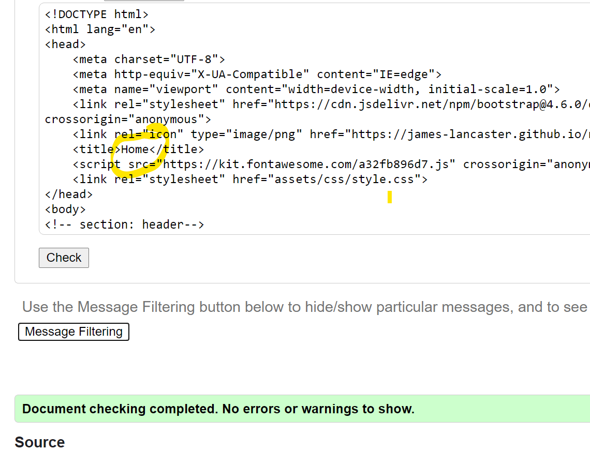

# Newcastle sculpture

Cities and towns the world over are adorned with public sculpture. Much of the time it gets sadly little attention from passers-by. It’s worth stopping to take a look, though, because not only are there some wonderful artistic gems to enjoy, there’s lots to be learned about local history, and about an area’s people and communities. 

As far as I can tell, there are few websites devoted to an individual city or town’s sculpture (Lichfield’s [The city of sculpture] (http://www.thecityofsculpture.co.uk/) is a rare example), but I’ve often thought I’d like to be able quickly to find out about an individual city’s public art, and I think there’s enough in Newcastle-upon-Tyne for it to be worthwhile providing a guide for others. In the fullness of time such a guide could provide guided walks and could expand to Northumbria and other cities in the North East. For now, a Newcastle guide might be of interest to visitors and tourists, locals, culture vultures and local history geeks, and those looking for a walk on a Sunday afternoon.

NOTE: This is the first resubmission of a previously failed project. I will address some of the issues where appropriate in this README.

Deployed GitHub
https://james-lancaster.github.io/newcastle-sculpture/index.html

GitHub
https://github.com/james-lancaster/newcastle-sculpture

Gitpod
https://8000-gold-lobster-gtvm3qng.ws-eu16.gitpod.io/locations.html

# User experience (UX)

## User stories
1. As a first time visitor, I would like to
* easily understand the main purpose of the site and be reassured that I have found a site containing useful information about sculpture 
* be able to easily navigate throughout the site to find content
* find meaningful content, for instance, relevant information about Newcastle-upon-Tyne and its public art, with images, locations, and background information 
* to find information that would enable me to physically visit the sculptures
* join a mailing list and become part of a sculpture-loving community, if the site and its contents interest me, I might wish to
* follow the social media links relevant art world and local interest news

2. As a returning visitor, having found something useful or interesting in the site, I would like to
* find up to date information
* plan further visits to sculpture
* contribute information I have found about sculptures

## Strategy (user needs and business objectives)
1. The website is created simply for the pleasure of sharing information and to reach out to and connect with people with similar interests, or who might have similar interests. There are no plans for the site to be commercial in any way, for instance, by attracting sponsorship or advertising from local businesses
* The site must provide valuable information, in particular
  * Accurate details of the sculptures – name, sculptor, date, etc
  * Accurate location details, including details to plot them on Google Maps
* The site should provide a way to keep people informed about sculpture – in the first instance, by a newsletter, so that it’s not just a directory or gazetteer, but has an authorial voice.

2. The user stories above don’t rely on any particular demographic, but the tone of the site might appeal more to people with an existing interest in the arts or history. Included among users might be:
* tourists and visitors to Newcastle who would like some guidance and advice
* people interested in the visual arts, whether visiting Newcastle or resident
* local people wanting to get to know the city better
* people looking for an interesting way to spend some time in or near the city centre 

These different groups don’t necessarily need different information or functionality from the site.

## Scope (functional specifications and context requirements)
1. As a start, the website needs to provide the basic information described above
* Details of the sculptures
* Locations of the sculptures
* Photos of the sculptures
* Newsletter sign up form

2. Aspects to save till later:
* A separate page for each sculpture
* A full listing of all sculptures
* Suggested itineraries
* A facility for users to contribute information

## Structure (interaction and information design)
1. The site has a simple structure, one layer deep. Users may arrive on the home page, from which they navigate via the navigation bar to the other pages. Any pages can be equally navigated to from any other page. As stated above, other pages might be created, but these would not be accessible from the top navigation. This is beyond the scope of this project.

2. Home
* Sculpture image (hero image)
* Introductory text
* Small sculpture image for variety and interest

3. Location
* Introductory text
* Google Maps showing locations of sculptures

4. Newsletter
* Sculpture image
* Introductory text
* Newsletter sign up form
* Information about the Newcastle Sculpture project

## Skeleton (interface, navigation, and information design)
1. Wireframe mock-ups were developed on [Figma](https://www.figma.com/file/EqO2BiXVqD4TIBJpvrEOWr/Newcastle_sculpture_01?node-id=0%3A1)

2. Colour scheme and imagery
* The colour scheme is based on modern minimal art and culture design, to give serious feel to the sight (rather than a local information / local entertainment style site)

3. Photographs
* Some photographs are mine. Others are acknowledged as appropriate in this README.

4. Fonts
* Two variable Google Fonts were chosen. Work Sans has a bold, industrial, urban feel for the main heading, while Lato, used for the rest of the text, is clear, simple, and modern. Sans Serif is the fallback font in case the font isn't imported into the site correctly.

## Surface (visual design)
1. The header includes a simple logo, formed form the site’s initials NS. This serves also as a favicon. On larger screens there is a navigation bar, and on smaller screens a toggler icon leading to the navigation.

2. The page body on all pages is a simple white, preferable to background colours I have experimented with for their contemporary feel to set off the sculpture colours. Colour has been added sparingly.

3. On all screen sizes the footer contains social media icons. I have modified the footer to a grey-green to close the page without fuss.

4. The Home page is presented as relatively uncluttered. A well known sculpture takes up somewhat over half a desktop screen, with empty space either side, and the full width of a mobile screen. Underneath is some simple introductory text and another sculpture image, chosen to contrast in subject with the main hero image.

5. The Locations page is the filling of the website, so to speak, between the other two pages. Here is the map with the details of the sculptures on it.

6. The Newsletter page is very simple, with a sign up form [and a contact form?]. Underneath is a more colourful photo.

# Features
## Existing features
1. Responsive on all devices
2. The header contains a conventionally placed logo in the top left hand corner (with a link to send users to the home page). Navigation is in the top right of the page. On smaller screens, a toggler menu appears on the right, while the menu drops down on the left.
3. The footer contains links to standard social networking sites Facebook, Twitter, Instagram, and Pinterest.
4. Locations page – shows a simple map utilising Google Maps API, with markers of a selection of sculptures and some information about the sculptures
5. Quiz page – a quiz with images and modals both for images and for responses to user input. The user’s score is calculated and a brief message relayed to them.
5. Contact page – includes an EmailJS email form.

## Features left to implement
1. The locations feature is still sparse, without much helpful guidance as yet.
2. Possibility for users to upload comments and information
3. The quiz no longer has modals giving an instant response to a user’s answer.
4. Better interaction, so that users could provide information about sculptures

## Issues and bugs
1. Navbar
* I was advised to put the main heading for the site in the navbar; this created formatting difficulties, to some extent resolved by the use of media queries, but possibly unsatisfactory movement through break points.

2. Home
* I don’t think the main images sits very well on the page, despite helpful advice from Tutor Assistance (the modification of the padding on col-md-auto).

3. Quiz
* I see from my previous README that I had great difficulty laying out the images and text in correct columns. This was very straightforward to fix using a standard Bootstrap columns layout and just carefully building the layers of columns and rows.
* Layout of question 4. Again, I see that I had great problems with this in my previous attempt, but with a better structure the problems were resolved.
* My first attempts to sum the quiz answers met with multiple problems. In fact, I was unable to get the issue resolved with Tutor Assistance, so quickly built a simple radio button quiz. This had the unfortunate effect of disabling the modals, but I chose to forgo that feature. I have left the code, commented out, in quiz.js.

4. The EmailJS form proved particularly difficult, as attempts to complete the form generated a 412 (precondition failed) error, when ‘access to the target resource has been denied’ (https://developer.mozilla.org/en-US/docs/Web/HTTP/Status/412). The details in the EmailJS events dashboard started:
    "Hotmail: Message failed: 554 5.2.252
    STOREDRV.Submission.Exception:SendAsDeniedException.MapiExceptionSendAsDenied;"

Tutor Assistance suspected that it could be a bug in EmailJS; it’s not clear to me what the events response related to, since there’s no Hotmail in the code, unless that relates to Outlook. The EmailJS Crew denied there were any bugs, but suggested the problem came from my having made some changes to the template. Perhaps this is so, in which case I’ll make sure I get every detail of an EmailJS template perfect when I set it up, and not amend it if I wish to improve it. However, by the time they gave me this advice, Tutor Assistance had a suggested fix, which was to move some of the JavaScript from contact.js into the head of contact.html. I still am not clear why this works.

As with the quiz, a side-effect of this was the failure of a modal thanking the user for being in touch. Again, I have commented out the code.

5. Images – I have used quite high quality images for the three main hero images on the home, quiz, and contact pages. I think this causes the site to load too slowly. I would have liked to have resized them (say, 1024px max).

# Technologies used
## Languages used
1. HTML5
2. CSS3
3. JavaScript (imported from Bootstrap and unmodified)
4. jQuery

## Frameworks, libraries & programs used
1. [Bootstrap 4.5.6](https://getbootstrap.com/)
* Bootstrap is used for responsiveness and for specific components (grid and columns, modals, navbar)
2. [Google Fonts](https://fonts.google.com/)
* Google Fonts is used for both fonts (Work Sans and Lato)
3. [Font Awesome 5.15.3](https://fontawesome.com/)
* Icons to close the navbar toggle and for social media and streaming sites are provided by Font Awesome
4. [jQuery](https://jquery.com/)
* jQuery is used with Bootstrap to make the navbar responsive, and again with Bootstrap for the modals.
5. [Google Maps API](https://cloud.google.com/maps-platform)
* Google Maps API is used for the locations map.
5. [EmailJS](https://www.emailjs.com/)
* EmailJS is used for the contact email
6. [Git] https://git-scm.com/)
* Git was used for version control by utilizing the Gitpod terminal to commit to Git and push to GitHub.
7. [GitHub](https://github.com/)
* GitHub is used to store the projects code after being pushed from Git.
8. [Figma](https://www.figma.com/)
* Figma was used to create the wireframes during the design process.

# Testing
## Validators
1. W3C CSS Validator – results

* style.css – no errors
   

2. W3C Markup Validator – results

* index.html – no errors
   

* locations.html – just two routine warnings
   

* quiz.html – no errors
   

* contact.html – errors for the use of “required” on an input element; however, this follows the format of EmailJS; routine warnings
   
   
  

3. JSHint

* locations.js – undefined and unused variables, that are used and functioning fine
    

* quiz.js – one undefined and one unused variable – but functioning fine
   

* sendEmail.js – seven warnings, but about EmailJS code; two undefined variables, functioning fine
   

## Testing user stories
1. As a first time visitor, I would like to
* I easily understand the main purpose of the site and be reassured that I have found a site which may have what I am looking for
  * On the home page, the hero image shows a statue at an iconic location in Newcastle (the Millennium Bridge). The navigation bar clearly shows the pages of the site so the user can find what they are looking for
* be able to easily navigate throughout the site to find content
  * Upon entering site (whichever page they enter on) the visitor sees a clean and easily understandable navigation bar to enable them to go to the page of their choice
* find meaningful content, for instance, relevant information about Newcastle-upon-Tyne and its public art, with images, locations, and background information
  * There is not yet enough information on the site to say that this has been achieved
* to find information that would enable me to physically visit the sculptures
  * There is a locations page with statues locations and basic information
* I join a mailing list and become part of a sculpture-loving community, if the site and its contents interest me, I might wish to
  * A contact form has been added
* follow the social media links relevant art world and local interest news
  * Social media links are added in the footer

2. As a returning visitor, having found something useful or interesting in the site, I would like to
* find up to date information
  * The only way this can be achieved at the moment is through the social media links and the contact form / newsletter.
* plan further visits to sculpture
  * There is a locations page with statues locations and basic information
* contribute information I have found about sculptures
  * This has not been achieved

## Further testing
1. For desktop and laptop, the website was tested on Google Chrome, Microsoft Edge, and Mozilla Firefox browsers on desktop
2. For mobile phones, the website was tested on Microsoft Edge, Mozilla Firefox, and Opera on Android.
3. Links were extensively checked and layout examined
4. Friends and family were asked to comment on the site

## Known bugs
1. On the Edge browser (but not Firefox or Opera) one of the pictures tips onto its side. This is not a problem in any desktop whatever the window width.
2. The containers on the home page no longer spread across the screen on the mobile. The formatting was adjusted with Tutor Assistance earlier in the day, and I can’t see what’s changed.
3. I see from the DevTools console that there are two violations: (i) ‘[Violation] Added non-passive event listener; (ii) ‘[Violation] 'setTimeout' handler took 58ms’. I understand from, eg, [StackOverflow](https://stackoverflow.com/questions/42218699/chrome-violation-violation-handler-took-83ms-of-runtime) that is a warning rather than an error report.
4. There were modals in the quiz giving users the correct answers. These no longer function, after I changed the structure of the quiz in response to ongoing and unresolved difficulties with jQuery.
5. There was also an acknowledgment modal in the contact form, that was lost when changes were made to the JavaScript to resolve errors, in particular a 412 error.

# Deployment
## GitHub Pages
The project was deployed to GitHub Pages using the following steps
  1. Log in to [GitHub](https://github.com/) and locate the repository – for me https://github.com/james-lancaster/newcastle-sculpture
  2. At the top of the Repository (not top of page), locate the "Settings" Button on the menu.
  3. Scroll down the page to GitHub Pages and click on ‘Check it out here!’ in the yellow box.
  4. Under "Source", click the dropdown called "None" and for the branch select ‘master’.
  5. If you wish select a Jekyll theme (I didn’t).
  6. You will now see in the green box ‘Your site is published at …” – for me, https://james-lancaster.github.io/newcastle-sculpture/ 

## GitHub pages - creating a clone
1. Log in to [GitHub](https://github.com/) and locate the repository – for me https://github.com/james-lancaster/newcastle-sculpture
2. Above the list of files, click Code.
3. To clone the repository using HTTPS, under "Clone with HTTPS", click the copy symbol
4. On your computer, open Git Bash
5. Select the directory where you want the cloned repository to be located.
6. Type 'git clone’, and then paste the URL copied in step 3.
7. Press Enter. Your local clone will be created.

# Credits
## Code
1. Fonts are from Google Fonts.
2. Bootstrap 4.6 was used for the navigation bar, including jQuery for the toggle, the grid and column layout, and the quiz modals.
3. Icons are from [Font Awesome](https://fontawesome.com/)
4. To hide the X-close when the burger menu is shown, CSS was taken from [Bootstrap 4 Hamburger](https://www.codeply.com/p/sW0Dx7GUNr/bootstrap-hamburger-X), accessed via [Stack Overflow](https://stackoverflow.com/questions/28247310/bootstrap-mobile-menu-icon-change-to-x-close).
5. For the favicon, I used (https://favicon.io/), which also had advice on how to install it.
6. Google Maps API(https://cloud.google.com/maps-platform) is used for the map. 
Guidance was from the Code Institute lessons on Google Maps and from the [Google Maps tutorials](https://developers.google.com/maps/documentation/javascript/tutorials)
7. The modals for the quiz are Bootstrap modals. Tutor assistance provided advice on setting these up in JavaScript, and I found guidance at https://www.w3schools.com/bootstrap/bootstrap_modal.asp 
8. The basic method of summing the user’s answers is based on Briggs K. Javascript tutorial: make a quiz. Mrteacherkevin 17 Oct 2016. https://www.youtube.com/watch?v=C7NsIRhoWuE
9. [EmailJS](https://www.emailjs.com/) is used for the contact form.
10. I received considerable help from Tutor Assistance in attempting to resolve a 412 error; they suggested the JavaScript in the header on contact.html
11. I benefitted from looking at other students’ work, which my mentor shared with me, in particular the milestone project 2 of Miranda Thewlis, https://mkthewlis.github.io/Milestone-Project-2/index.html
12. In addition, I regularly consulted
* [StackOverflow](https://stackoverflow.com/)
* [W3Schools](https://www.w3schools.com/)

## Content
1. Photo credits
* arnatt-articulated-opposites: ‘Articulated Opposites’, 55 Degrees North. cc-by-sa/2.0 - © Andrew Curtis - geograph.org.uk/p/1673206 (https://www.geograph.org.uk/reuse.php?id=1673206)
* goscombe-john-response: Northumberland Fusiliers Memorial. By Christopher Down - Own work, CC BY 4.0, https://commons.wikimedia.org/w/index.php?curid=69351676 (https://en.wikipedia.org/wiki/Northumberland_Fusiliers_Memorial#/media/File:Northumberland_Fusiliers_Memorial.jpg)
* hill-black-rhinoceros: 'Black Rhinoceros', Hancock Museum. cc-by-sa/2.0 - © Andrew Curtis - geograph.org.uk/p/1759655 (https://www.geograph.org.uk/photo/1759655)
* maley-shearer: licensed under the Creative Commons Attribution-Share Alike 4.0 International license (https://commons.wikimedia.org/wiki/File:Statue_Shearer_Newcastle_Tyne_4.jpg)
* wallace-man-pigeons: I could find no accreditation
* wynne-river-god-tyne: Civic Centre, Newcastle Upon Tyne. cc-by-sa/2.0 - © wfmillar - geograph.org.uk/p/739095 (https://www.geograph.org.uk/photo/739095)
* Other photos mine
2. Much useful information in Usherwood P, Beach J, Morris C. Public sculpture of North-East England. Liverpool University Press 2000 (not online).

## Acknowledgements
* Many thanks to Seun Owonikoko for support and encouragement
* Many thanks to the Tutor Assistance team for a lot of support and guidance.

James Lancaster 31 August 2021